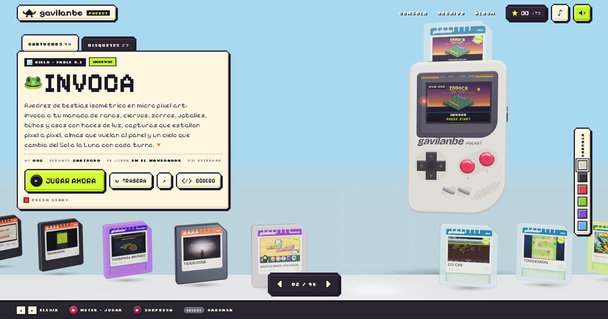

<div align="center">

# 🎮 gavilanbe POCKET

**Toda mi colección de juegos en cartuchos y disquetes. Elige uno, mételo en la consola y pulsa START.**

[](https://gavilanbe.github.io/)

</div>



Una sola página estática: los juegos viven en [`data.js`](data.js) y las miniaturas en
[`thumbs/`](thumbs/). La consola es 3D de verdad (three.js desde jsDelivr); el
resto es HTML, CSS y JavaScript sin build.

## Cómo funciona

- **La consola.** *gavilanbe POCKET* en 3D (three.js): carcasa con biseles y la
  esquina inferior derecha redondeada, costura entre mitades, marco de pantalla
  con volumen, cruceta con flechas en relieve, botones A/B abombados y un frontal
  con **mapa de normales generado** (los huecos de los botones y la rejilla del
  altavoz reaccionan a la luz al girarla). Seis carcasas (**SELECT** o `S`).
- **La pantalla es un LCD de 160×100 de verdad**: todo se pinta a resolución nativa
  y se amplía ×3 sin suavizado con rejilla de matriz de puntos. El arranque:
  retroiluminación, el gavilán pixelado bajando píxel a píxel, *ding*, un brillo
  del color de la edición, «POCKET» letra a letra y disolución en bloques hasta la
  pantalla de título con PRESS START. A veces hay **error de lectura** y toca soplar
  (con el botón o con el micrófono).
- **La cinta**: todos los cartuchos en 3D delante de la consola; `←` `→`, arrastrar,
  la cruceta o un mando real. START mete la cámara en la pantalla y abre el juego;
  al volver, la consola te recibe. Los disquetes van a un PC retro que teclea el
  `git clone`.
- **Interfaz de videojuego**: cajas con borde de píxel escalonado y sombra dura,
  cuadro de diálogo de RPG que escribe la descripción, botones con glifos de la
  consola (Ⓐ, Ⓑ, START, SELECT), barra de controles, marcador de pegatinas,
  avisos de logro, cursor pixelado, tipografías Pixelify Sans y Silkscreen, y
  animaciones a pasos (`steps()`).
- **El archivo** (Mundo 2): estantería de madera con los cartuchos de canto por
  edición y archivador de disquetes. Cada pieza se asoma, sale girando a una
  pantalla de «objeto» con su ficha y su trasera, y vuela a la consola.
- **Álbum de pegatinas** (Mundo 3) y **créditos** al final.
- Rendimiento: sin refracción, sombras dinámicas ni postprocesado; render bajo
  demanda y resolución adaptativa.

La versión anterior (la consola horizontal y la tienda nocturna) sigue en
[`/classic/`](https://gavilanbe.github.io/classic/) y en la etiqueta git `arcade-v1`.

## Desarrollo

`node scripts/build.mjs` valida el JavaScript y copia lo publicable en `dist/`.
`npm ci && npm test` ejecuta las regresiones de la colección y de la versión clásica.

## Añadir un juego

1. Añade su entrada en `data.js` (orden alfabético por `name`):

```js
{
  "name": "mi-juego",                                   // slug del repo
  "title": "🎮 MI JUEGO",                               // con su emoji
  "tagline": "Una frase con gancho.",
  "type": "web",                                        // "web" | "terminal"
  "play": "https://gavilanbe.github.io/mi-juego/",      // vacío si es terminal
  "repo": "https://github.com/gavilanbe/mi-juego",
  "thumb": "thumbs/mi-juego.jpg",                       // 640×400 (16:10)
  "wip": false,                                          // cinta adhesiva "WIP"
  "new": true,                                           // pegatina "NUEVO"
  "kind": "juego",
  "model": "astra"            // edición de plástico: "opus-5.5" | "astra" | "fable-5.1" | "fable" | "opus-4.8" | "opus-4.7" | "opus-4.6"
}
```

2. Deja su captura en `thumbs/mi-juego.jpg` (640×400).
3. Si es de los buenos, ponlo en la lista `FEATURED` de `index.html`: sale antes en la cinta de la consola. Un modelo nuevo funciona solo; para darle nombre de plástico y color de plató añádelo a `EDITIONS` (`index.html`) y su material 3D a `edMat` (`pocket3d.js`).
4. Quita el `"new": true` de la hornada anterior.

El cartucho **TRAZO** es de edición `astra` (plástico fosforito) y se publica en [gavilanbe.github.io/trazo/](https://gavilanbe.github.io/trazo/). Su código vive en [gavilanbe/trazo](https://github.com/gavilanbe/trazo).

El cartucho **NAGU & GAVI · El corazón de la selva** también es `astra`: [jugar](https://gavilanbe.github.io/nagu-gavi/) · [código](https://github.com/gavilanbe/nagu-gavi). Incluye intro con retratos parlantes, cinco semillas de sol y 36 plumas.

El cartucho **INVOCA** (ajedrez de bestias isométrico en micro pixel art) es de edición `fable-5.1` (hielo): [jugar](https://gavilanbe.github.io/invoca/) · [código](https://github.com/gavilanbe/invoca).
